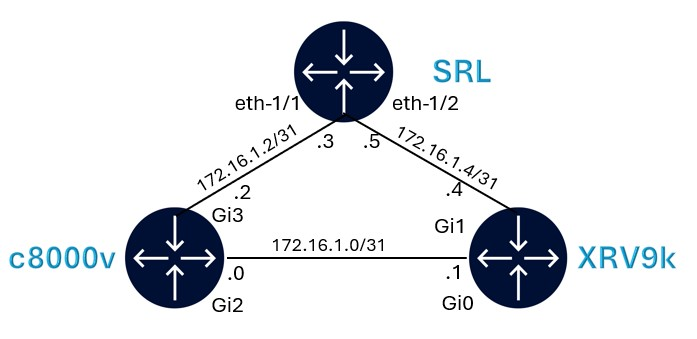

# VM-based nodes in containerlab

VM nodes integration in containerlab is based on the [hellt/vrnetlab](https://github.com/hellt/vrnetlab) project which is a fork of `vrnetlab/vrnetlab` where things were added to make it work with the container networking.

Start with cloning the project:

```bash
cd ~ && git clone https://github.com/hellt/vrnetlab.git && \
cd ~/vrnetlab
```

## Building Cisco XRV9k container image

XRV9k VM image is located at `~/images/xrv9k-fullk9-7.9.2.qcow2` on your VM and should be copied to the `~/vrnetlab/xrv9k/` directory before building the container image.

```bash
cp ~/images/xrv9k-fullk9-7.9.2.qcow2 ~/vrnetlab/xrv9k/
```

Once copied, we can enter in the `~/vrnetlab/sros` image and build the container image:

```bash
cd ~/vrnetlab/xrv9k
make docker-image INSTALL=false
```

The resulting image will be tagged as `vrnetlab/nokia_sros:24.7.R1`. This can be verified using `docker images` command.

```bash
REPOSITORY              TAG       IMAGE ID       CREATED         SIZE
vrnetlab/cisco_xrv9k    7.9.2     136ee1223a9d   9 seconds ago   2.11GB
```

## Cisco c8000v container image

c8000v VM image is located at `~/images/c8000v-17.06.03.qcow2` on your VM and should be copied to the `~/vrnetlab/c8000v/` directory before building the container image.

```bash
cp ~/images/c8000v-17.06.03.qcow2 ~/vrnetlab/c8000v/
```

Once copied, we can enter in the `~/vrnetlab/sros` image and build the container image:

```bash
cd ~/vrnetlab/c8000v
make docker-image
```

The resulting image will be tagged as `vrnetlab/nokia_sros:24.7.R1`. This can be verified using `docker images` command.

```bash
REPOSITORY              TAG        IMAGE ID       CREATED          SIZE
vrnetlab/cisco_c8000v   17.06.03   7f8f3ce05ef4   5 seconds ago    2.94GB
```

## Deploying the VM-based nodes lab

With the cisco images built, we can proceed with the lab deployment. We will deploy a lab with SR Linux, XRV9k and c8000v to show that Containerlab can have a VM based docker node and a native docker node in the same lab.

Here's the topology.



First, let's switch back to the lab directory:

```bash
cd ~/wk320/20-vm
```

Now lets deploy the lab:

```bash
sudo clab dep -c
```

At the end of the deployment, the following table will be displayed. Wait for the vmx boot to be completed (see next section), before trying to login to vmx.

```bash
╭───────┬────────────────────────────────┬─────────┬───────────────────╮
│  Name │           Kind/Image           │  State  │   IPv4/6 Address  │
├───────┼────────────────────────────────┼─────────┼───────────────────┤
│ iosxe │ cisco_c8000v                   │ running │ 172.20.20.3       │
│       │ vrnetlab/cisco_c8000v:17.06.03 │         │ 3fff:172:20:20::3 │
├───────┼────────────────────────────────┼─────────┼───────────────────┤
│ srl   │ nokia_srlinux                  │ running │ 172.20.20.4       │
│       │ ghcr.io/nokia/srlinux          │         │ 3fff:172:20:20::4 │
├───────┼────────────────────────────────┼─────────┼───────────────────┤
│ xrv9k │ cisco_xrv9k                    │ running │ 172.20.20.2       │
│       │ vrnetlab/cisco_xrv9k:7.9.2     │         │ 3fff:172:20:20::2 │
╰───────┴────────────────────────────────┴─────────┴───────────────────╯
```

### Monitoring the boot process

To monitor the boot process of xrv9k node, you can open a new terminal and run the following command:

```bash
docker logs -f xrv9k
```

Not that XRV9k takes atleast 10 mins to boot up. Wait until the below message appears in the logs before logging in.

```bash
2025-03-17 20:02:18,841: base_driver    INFO connection to '127.0.0.1' on port '5000' closed successfully
2025-03-17 20:02:18,841: launch         INFO Startup complete in: 0:10:52.408518
```

Similarly, monitor the boot logs for c8000v. It takes around 2mins to boot up.

```bash
docker logs -f iosxe
```

Wait until the below message appears on c8000v logs:

```
2025-03-17 20:45:10,372: base_driver    INFO connection to '127.0.0.1' on port '5000' closed successfully
2025-03-17 20:45:10,372: launch         INFO Startup complete in: 0:02:06.834517
```

## Connecting to the nodes

To connect to SR Linux node:

```bash
ssh srl
```

To connect to XRv9k node:

```bash
ssh clab@xrv9k
```

To connect to c8000v node:

```bash
ssh admin@iosxe
```

Refer to the passwords in your sheet.

## Configuration

All 3 devices are configured with a startup configuration that will create the interfaces and configure BGP sessions between the 3 devices.

Run a ping between the interface to confirm reachability.

Login to SR Linux node and run a ping to c8000v:

```srl
ping -c 3 172.16.1.2 network-instance default
```

Check BGP neighbor status on all 3 nodes:

SR Linux:

```srl
show network-instance default protocols bgp neighbor
```


XRv9k and c8000v:

```srl
show bgp ipv4 unicast summary
```

We have now completed the section on bring VM based nodes into Containerlab.

You may destroy the lab using:

```bash
sudo clab des -t ~/wk320/20-vm/vm.clab.yml
```

