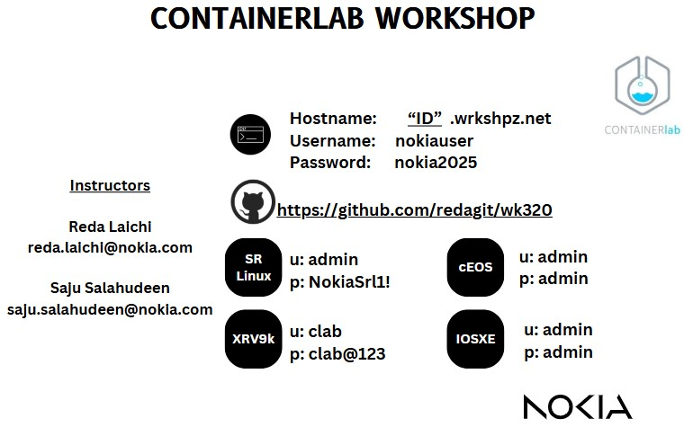

# Welcome to the Containerlab & EVPN Workshop 

This README is your starting point into the hands on section.

Please contact [**Reda Laichi**](https://www.linkedin.com/in/reda-l-5b28292) or [**Saju Salahudeen**](https://www.linkedin.com/in/saju-salahudeen) if you have any questions.

Pre-requisite: A laptop with SSH client

## Lab Environment

A Nokia team member will provide you with a card that contains:
- your VM hostname
- SSH credentials to the VM instance
- URL of this repo

> 
!!! Make sure to backup any code, config, ... <u> offline (e.g on your laptop)</u>. 
> The VM instances will be destroyed once the Workshop is concluded.

## Workshop
The objectives of the hands on section of this workshop are the following:
- Understand containerlab 
- Using containerlab to deploy virtual networks and troubleshooting
- Build a DC fabric with leaf and spine
- Build Layer 2 EVPN-VXLAN
- Build Layer 3 EVPN-VXLAN

Shortcut links to the modules:

|   |
|---|
|  Containerlab Introduction
|  - [Containerlab Installation- Module 05](05-install/README.md)
|  - [Basics- Module 10](/10-basics/README.md)
|  - [Startup config - Module 15](/15-startup/README.md)
|  - [VM-based nodes- Module 20](/20-vm/README.md)
|  - [Packet capture- Module 40](/40-packet-capture/README.md)
|  - [Streaming Telemetry](Bonus-Telemetry/README.md)
| Deploying DC Leaf & Spine Fabric
| 1- [Lab Topology](evpn/README.md/#lab-topology/README.md) 
| 2- [Deploying the lab](evpn/README.md/#deploying-the-lab)
| 3- [BGP Underay](evpn/README.md/#configure-bgp-underlay) 
| 4- [BGP Overlay](evpn/README.md/#configure-bgp-for-overlay)
| 5- [Layer 2 EPVN](evpn/README.md/#configure-l2-evpn-vxlan) 
| 6- [CLI Quick Reference](evpn/README.md/#sr-linux-configuration-mode) 
| Bonus
| 1- [Layer 3 EVPN](evpn/README.md/#configure-layer-3-evpn-vxlan)  
| 2- [IRB](evpn/README.md/#bonus---interconnecting-layer-2-and-layer-3-using-irb)

